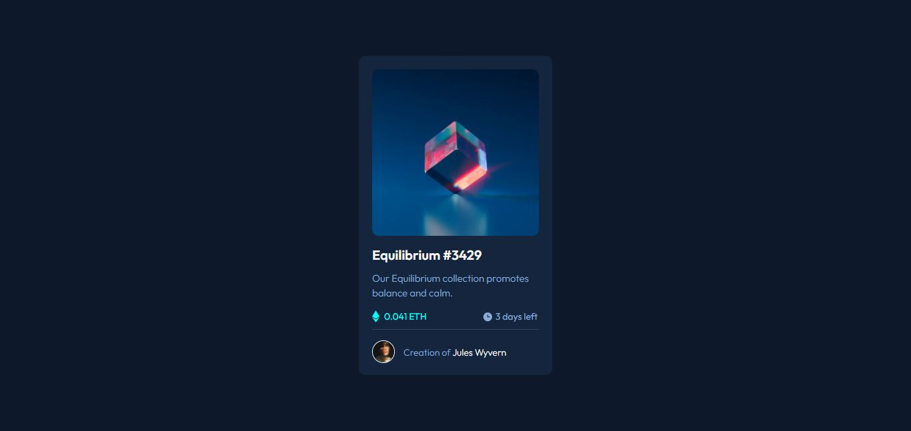
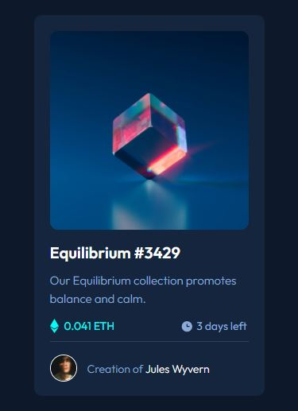

# Frontend Mentor - NFT preview card component solution

This is a solution to the [NFT preview card component challenge on Frontend Mentor](https://www.frontendmentor.io/challenges/nft-preview-card-component-SbdUL_w0U). Frontend Mentor challenges help you improve your coding skills by building realistic projects. 

## Table of contents

- [Overview](#overview)
  - [The challenge](#the-challenge)
  - [Screenshot](#screenshot)
  - [Links](#links)
- [My process](#my-process)
  - [Built with](#built-with)
  - [What I learned](#what-i-learned)
  - [Continued development](#continued-development)
  - [Useful resources](#useful-resources)
- [Author](#author)
- [Acknowledgments](#acknowledgments)

## Overview
 To design a NFT review card.

### The challenge

Users should be able to:

- View the optimal layout depending on their device's screen size
- See hover states for interactive elements

### Screenshot





### Links

- Solution URL: [Add solution URL here](https://your-solution-url.com)
- Live Site URL: [Add live site URL here](https://your-live-site-url.com)

## My process
  reate a Tree struvture to have a overview of the tag going to be used.
  Make a appropiate padding and margin size using rough draft.
  Create HTML and CSS file and implement.
### Built with

- Semantic HTML5 markup
- CSS custom properties
- Flexbox


### What I learned
 learned to add border to circular images
 learned to use flexbox

```html
<!DOCTYPE html>
<html lang="en">
<head>
	<meta name="viewport" content="width=device-width, initial-scale=1">
	<title>NFT preview</title>
	<link rel="stylesheet" type="text/css" href="index.css">
	<link rel="icon" type="iamge/x-icon" href="./images/favicon-32x32.png">
	<link rel="preconnect" href="https://fonts.googleapis.com">
	<link rel="preconnect" href="https://fonts.gstatic.com" crossorigin>
	<link href="https://fonts.googleapis.com/css2?family=Outfit:wght@300;400;600&display=swap" rel="stylesheet">
</head>
<body>
	<main>
		<section id="block-eth">
			
			<span id="images"></span>
			<h1>
				Equilibrium #3429 
			</h1>
			<p style="font-size: 15px;">
				Our Equilibrium collection promotes balance and calm.
			</p>
			<div id="eth">
				<div id="eth-item1">
					<span id="eth-span1" > 0.041 ETH</span>
				</div>
				<div id="eth-item2">
					
					<span id="eth-span2">3 days left</span>
				</div>
			</div>
			<div id="eth-avatar">
				
				<span id="ava-span1" > Creation of </span>
				<span id="ava-span2" > Jules Wyvern </span>
			</div>
		</section>
	</main>
	<footer >
		<p id="footer-para">
			Challenge by <a href="https://www.frontendmentor.io/home">Frontend Mentor</a>. Coded by <a href="https://github.com/mathanraj0601">Mathanraj T
			</a>.
		</p>
	</footer>

</body>
</html>
```
```css
*
{
	padding: 0;
	margin: 0;
	font-family: 'Outfit', sans-serif;
	font-size: 14px;
	font-weight:300;
}
main{
	height: 97vh;
	width: 100vw;
	display: flex;
	flex-direction: column;
	align-items: center;
	justify-content: center;
	background: hsl(217, 54%, 11%);
	font-size: 1. rem;
}
#block-eth
{
	/*text-align: center;*/
	width: 290px;
	height: auto;
	box-sizing: border-box;
	padding: 20px;
	/*margin: 20px;*/
	background:hsl(216, 50%, 16%);
	border-radius: 10px;

}

#image-eq
{
	border-radius: 10px;
}
#image-eq:hover
{
	fill: hsl(178, 100%, 50%);

}
#images{
	border-radius: 10px;
	position: absolute;
	bottom: 295px;
	height: 250px;
    width: 250px;
    display: block;
    background: transparent;
}
#images:hover
{
	display: block;
	background: hsl(178, 100%, 50%);
	background-image: url(./images/icon-view.svg);
    background-repeat: no-repeat;
    background-position: center;
    
	opacity: 0.5;
}
h1
{
	font-weight: 600;
	font-size: 20px;
	margin: 12px 0px;
	color: hsl(0, 0%, 100%);
}
h1:hover
{
	color:  hsl(178, 100%, 50%);
	cursor: pointer;
}
p
{
	font-weight:300;
	line-height: 1.5;
	color:  hsl(215, 51%, 70%);
}

#avatar
{
	border-radius: 50%;
	border: 1px solid hsl(0, 0%, 100%);
	position: relative;
	top: 11px;
}
#eth
{
	border-bottom: 1px solid hsl(215, 32%, 27%);
	padding: 10px 0px;
}

.eth-image
{

	position: relative;
	top: 4px;
}
#eth-item1, #eth-item2
{
	display: inline-block;
}
#eth-item2
{
	margin-left:80px;
}
#eth-span1
{
	color:  hsl(178, 100%, 50%);
	font-weight: 400;
	margin-left:4px ;
}

#eth-span2
{
	color:  hsl(215, 51%, 70%);
	font-weight: 400;
}
#eth-avatar
{
	padding: 5px 0px;
	
}

#ava-span1
{
	font-weight: 300;
	margin-left: 10px;
	color:hsl(215, 51%, 70%) ;
}
#ava-span2
{
	font-weight: 300;
	color:hsl(0, 0%, 100%) ;
}
#ava-span2:hover
{
	color:  hsl(178, 100%, 50%);
	cursor: pointer;

}
#footer-para
{
	font-weight: 700;
	color:  hsl(178, 100%, 50%);
	font-size: 15px;
	padding: 10px;
	text-align: center;
	text-decoration: none;
	background: hsl(217, 54%, 11%);
}
```


### Continued development

Learned certain accessilbity in HTML on future projects try to learn more accessibility.


### Useful resources

- [Stack oveflow] - center a div suing flexbox.
- [geeks for  geeks] - overlay a color on image when user hover it.
## Author

- Website - [Mathnaraj T](https://github.com/mathanraj0601)
- Frontend Mentor - [@mathanraj0601](https://www.frontendmentor.io/profile/mathanraj0601)


## Acknowledgments

I like to thank  GFG and stack oveflow where i learned to overlay a color on image when user hover it.


